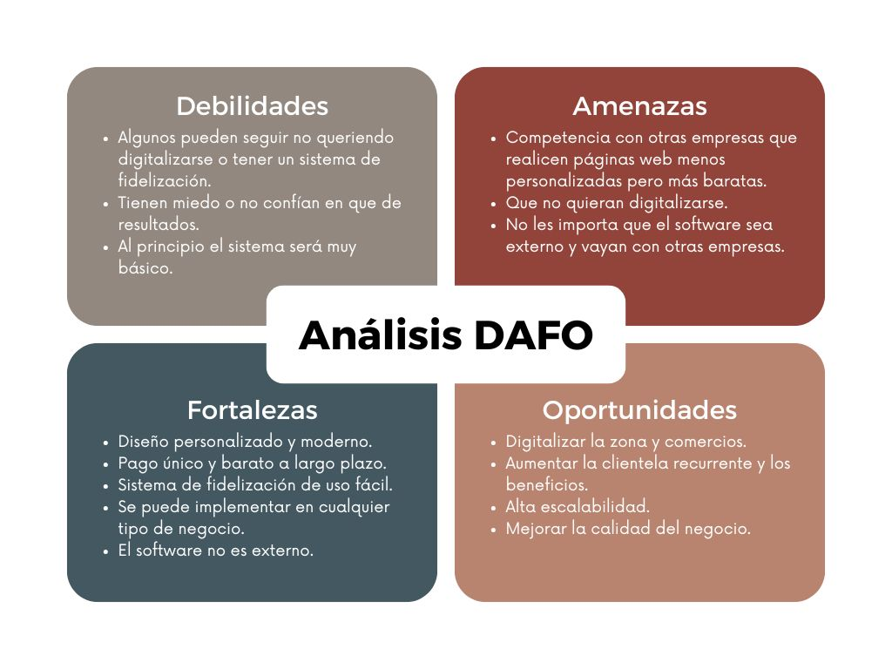
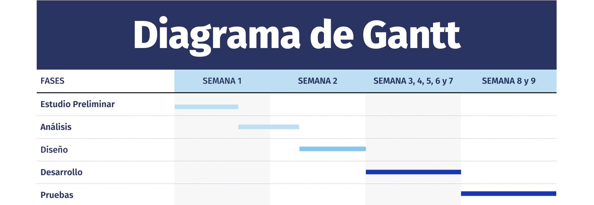

# Anteproxecto fin de ciclo

- [Anteproxecto fin de ciclo](#anteproxecto-fin-de-ciclo)
  - [1- Descrición do proxecto](#1--descrición-do-proxecto)
  - [2- Empresa](#2--empresa)
    - [2.1- Idea de negocio](#21--idea-de-negocio)
    - [2.2- Xustificación da idea](#22--xustificación-da-idea)
    - [2.3- Segmento de clientes](#23--segmento-de-clientes)
    - [2.4- Competencia](#24--competencia)
    - [2.5- Proposta de valor](#25--proposta-de-valor)
    - [2.6- Forma xurídica](#26--forma-xurídica)
    - [2.7- Investimentos](#27--investimentos)
      - [2.7.1- Custos](#271--custos)
      - [2.7.2- Ingresos](#272--ingresos)
    - [2.8- Viabilidade](#28--viabilidade)
      - [2.8.1- Viabilidade técnica](#281--viabilidade-técnica)
      - [2.8.2 - Viabilidade económica](#282---viabilidade-económica)
      - [2.8.3- Conclusión](#283--conclusión)
  - [3- Requirimentos técnicos](#3--requirimentos-técnicos)
  - [4- Planificación](#4--planificación)

## 1- Descrición do proxecto

El proyecto consiste en diseñar una página web con un sistema de fidelización para una empresa real, en este caso el restaurante LAMARTA, en Vilagarcía de Arousa.  La clave es proporcionar un diseño diferente, único y atractivo, que la mayoría no tienen y que no sea una plantilla cualquiera, sino algo personalizado adecuando la página a la imagen del negocio. Además, se incluiría un sistema básico de puntos, en el que los clientes podrán obtenerlos al realizar pagos en el establecimiento. 

La mayoría de comercios locales por esta zona aún no disponen de página web y los que sí, muchos no tienen una original o diferente a lo que se suele ver. También muchos de ellos aún recurren a métodos de fidelización físicos como pueden ser los bonos en papel. Cada cliente podría crear una cuenta y en cada compra el dependiente le añadirá los puntos o le canjeará las recompensas correspondientes.

Otras plataformas que dan servicios de este tipo suelen cobrar una cantidad alta mensualmente por integrar su software en la página, lo que es un gran dolor para ellos porque tienen menos poder de inversión y los que se desarrollan exclusivamente tienen costes muy elevados. La idea es estar en el punto medio, dar un servicio de pago único, simple, moderno y que a largo plazo sea más barato para el cliente que mantener una cuota mensual de por vida.

Con el tiempo se quiere ir actualizando y mejorando el sistema para que los usuarios que más lo utilizan y quieran disponer de una mejor versión puedan pagar para actualizarla. De esta forma el comercio local tiene una oportunidad atractiva de digitalizar su negocio y mantener su clientela, algo imprescindible hoy en día.

En cuanto a tecnologías, el frontend será desarrollado con React ya que la creación de componentes ahorra tiempo y código. Además podría mejorar la velocidad y facilitar la escalabilidad de la página en un futuro. El backend será realizado en PHP.

## 2- Empresa

### 2.1- Idea de negocio

El objetivo es digitalizar la empresa con una página moderna y única, que deje clara la esencia del negocio. Con un sistema simple de puntos pero que funcione y que ofrezca la posibilidad de recompensar a los clientes más habituales. 

Este tipo de servicio suele ser de un coste muy elevado y en la mayoría de los casos es de pago mensual, por lo que muchos comercios locales no quieren o no pueden pagarlo. A largo plazo, nuestra opción sería más económica ya que se realiza un pago único al comienzo, sin cuotas mensuales ni de mantenimiento, lo que lo hace más accesible. Se puede pagar mensualmente por un mantenimiento o actualización de contenidos en la página, pero como se decía, en el sistema de puntos no sería necesario. 

El sistema se irá mejorando y actualizando con el tiempo. En caso de que quieran pasar a la nueva versión o tener nuevas funciones, tendrían que pagar por ello, pero siempre pueden quedarse con la primera versión y sin nuevos costes. Nuestros clientes podrán obtener una bonificación si recomiendan nuestro servicio exitosamente. Así, conseguimos promover la escalabilidad y llegar a más gente.

### 2.2- Xustificación da idea

Mi hermano es el dueño del restaurante LAMARTA, que lleva abierto desde enero de 2024. En ese momento, él me encargó hacerle la página web, por lo que diseñé y desarrollé esta misma y desde entonces he intentado mantenerla lo mejor posible.

Desde hace meses me estuvo consultando la opción de tener un sistema con el que sus clientes puedan acumular puntos, ya que los demás que habían eran bastante caros, pues si quería que le desarrollasen algo más avanzado el presupuesto era de miles de euros. Y en cuanto a las opciones más económicas, son softwares de terceros que implican una suscripción mensual de cientos de euros o que necesitas disponer de conocimientos para aplicarlo a la web.

El caso de un familiar me hizo darme aún más cuenta de que podría haber mercado ya que en la tienda donde compra té, siguen utilizando el sistema de fidelización en papel, sellando una tarjeta. Esta tienda tampoco dispone de página web por lo que sería un potencial cliente para digitalizar y facilitar a los usuarios la obtención de recompensas. Evitando por ejemplo, que alguien pueda perder su tarjeta.

LoyaltyLion, Smile.io y Connectif son algunas empresas que ofrecen este servicio pero solo funcionan en páginas que son de Shopify y demás de e-commerce. Sus precios están entre los 50 y 500 euros mensuales dependiendo del plan. Hay otras que sí que podrían funcionar fuera de las plataformas de e-commerce pero o son muy caras también o no te ofrecen la creación de tu página personalizada.

En [este informe del INE 2023-2024](https://www.ine.es/dyngs/INEbase/es/operacion.htm?c=estadistica_C&cid=1254736176743&menu=ultiDatos&idp=1254735576799) vemos que las empresas con menos de 10 empleados apenas tienen páginas web (33%) a diferencia de las grandes.

Además, [en este artículo de SimplotFoods](https://www.simplotfoods.com/au/es/blog/do-restaurant-loyalty-programs-really-work) comenta acerca de diferentes estudios de cómo el mantener clientes proporciona mayor rentabilidad para el negocio frente a obtener nuevos y de lo bien que funcionan los programas o sistemas de fidelización para conseguirlo. La gente suele volver mucho más de esta forma.

La necesidad que se pretende cumplir es que los comercios locales tengan una página única y moderna, con el sistema de fidelización para sus clientes mediante un pago único no tan elevado. De esta forma, se consigue que obtengan algo propio, que puedan digitalizarse, que no les suponga un coste mensual de por vida y mantener más clientes habitualmente generando por lo tanto más ingresos. El modelo se puede adaptar a cualquier tipo de negocio, desde un taller, a un restaurante, a un centro de estética y demás.

### 2.3- Segmento de clientes

El objetivo es llegar a ese comercio local pequeño y mediano que aún no está digitalizado o que se puede mejorar su presencia online a la hora de conectar con sus clientes. Aumentar el alcance para multiplicar la clientela y enfocarse en mantenerla dejando atrás los métodos antiguos de fidelización, por los más modernos, simples, baratos y personalizados.

Los que ya son frecuentes, seguirán queriendo volver si les recompensas por su fidelidad. Los que son más ocasionales o nuevos pueden convertirse en frecuentes con más promociones.

En relación a lo comentado en el apartado de Idea de Negocio. La tienda de té sería un ejemplo perfecto de cliente potencial. Digitalizar su tienda y su sistema de bonos le daría más alcance y evitaría que los usuarios tengan la posibilidad de perder el papel de sellos u otro imprevisto.

Por lo tanto, este tipo de negocio es aplicable a cualquier sector. Cualquier empresa puede realizar programas de fidelidad y cómo anteriormente se analizó, más de un 60% de micropymes aún no están digitalizadas y se les puede ayudar a generar más ingresos y mejorar tanto la experiencia del local, como la del usuario.

### 2.4- Competencia

En cuanto a competencias, las anteriormente nombradas LoyaltyLion, Smile.io o Connectif, son de las más utilizadas a nivel nacional e internacional, teniendo así una gran cuota de mercado. Sus planes suelen ser de pago mensual y caros, algo que no es atractivo para los pequeños negocios. Además, son algo difíciles de manejar si no tienes ciertos conocimientos o si no utilizas una plataforma de e-commerce. Otro punto es que no siempre puedes integrarlo directamente en tu web, si no que habría que utilizarlo externamente.

Los locales utilizan los sistemas antiguos como producto sustitutivo, sellos en papeles, tarjetas y demás que a día de hoy presentan limitaciones a diferencia de los modernos.

Para ayudar a digitalizar estos comercios ofrecemos un sistema de pago único que resultaría en un precio más económico a largo plazo. Ayudando así a dejar los sistemas antiguos y obteniendo todos los beneficios que trae al negocio, anteriormente comentados en la justificación. Ofreciendo esta solución personalizada, simple, propia y fácil de utilizar conseguiremos difrenciarnos del resto.

### 2.5- Proposta de valor

Es muy difícil ver comercios locales con páginas que estén llenas de su identidad. Normalmente son plantillas o ni siquiera tienen una web. Además, no hay un sistema de fidelización sin complicaciones, simple, barato y que se adapte a los pequeños negocios.

Una página web atractiva para los usuarios, que se sienta propia y única, mejora la imagen del negocio ante los clientes. Además, ayudaría a ganar visibilidad, beneficios y destacar frente a la competencia.

La principal diferencia está en la forma de pago. Eliminamos el tedioso pago mensual para los negocios que no pueden o no quieren afrontar ese gasto indefinidamente. De esta forma, el comercio local gana una plataforma a la altura de la actualidad, con la misma calidad, distinguida, moderna, simple y efectiva, por un coste muy bajo a largo plazo.

Con nuestra página y sistema mejoramos la imagen, fidelizamos a sus clientes, aumentamos la visibilidad y damos la oportunidad de tener tecnologías o plataformas necesarias a día de hoy sin grandes inversiones. Esto todo se traduce en más beneficios. La gente disfrutará de acudir más a sus negocios favoritos sabiendo que incluso ganarán recompensas.

### 2.6- Forma xurídica

En este caso, autónomo, ya que se trata de un proyecto en el que voy a trabajar solo. Así consigo más flexibilidad, rapidez, menos costes y menos trámites. En el futuro, a medida que se vaya creciendo y haga falta expandir o contratar gente, se buscaría el cambio de forma jurídica.

### 2.7- Investimentos

Lo principal sería el equipamiento informático (ordenador, teclado, etc..), también los programas o servicios a utilizar (Hostinger), mobiliario,  conexión a internet y publicidad.

#### 2.7.1- Custos

Los costes fijos están compuestos por la cuota de autónomo (80 euros al mes el primer año), teléfono e internet (60 euros al mes), electricidad (20 euros al mes) y publicidad (50 euros al mes).

Los variables serían el dominio y hosting (70 euros al año), la publicidad adicional (50 euros al mes), ordenador y hardware (900 euros). 

En resumen, los costes fijos serían de un total de 210 euros aproximadamente y los variables de 1020 euros. Trimestralmente habría que liquidar el IVA (21%) sobre el precio de venta y el IRPF (7% el primer año al ser nuevo autónomo, 15% después). 

#### 2.7.2- Ingresos

> _EXPLICACIÓN_: Neste apartado indicarase unha previsión de ventas e unha política de prezos. Isto implicar apuntar unha previsión de ventas e unha política de prezos.

### 2.8- Viabilidade

#### 2.8.1- Viabilidade técnica

> _EXPLICACIÓN_: Neste subapartado deberás defender tendo en conta os datos xa aportados, a viabilidade da realización do proyecto.
> Evidentemente, para poder xustificar a viabilidade económica do proyecto deberás ter en conta os ingresos. **Ainda que está na parte de empresa, este apartado é interesante dende o punto de vista técnico**
>
> - Será posible dispoñer dos recursos humanos e medios de produción necesarios (materias primas, maquinaria, instalacións, etc.)?
> - Existe algún impedimento técnico que dificulte o proceso produtivo?

#### 2.8.2 - Viabilidade económica

> _EXPLICACIÓN_: Neste subapartado deberás defender con datos a viabilidade da realización do proyecto, para elo debes indicar os custos e investimentos:

#### 2.8.3- Conclusión

> - É viable?
> - Os beneficios do proxecto son superiores aos costes?
> - As perdas poden cubrirse vía financiamento (por parte da administración pública, con subvencións, etc)?

## 3- Requirimentos técnicos

- **Infraestructura:** Hostinger para alojar la API, Vercel para desplegar el frontend y MySQL para la base de datos.
- **Backend:** API en PHP crudo.
- **Frontend:** React, HTML, CSS y JavaScript.

## 4- Planificación

Semana 1: Realización del anteproyecto (la primera idea, si funciona, si es viable y demás). También comienzo a pensar en la estructura y sus acciones. 

Semana 1 y 2: Defino de que estará compuesta mi aplicación tras haberla estructurado con todas las funciones, que me viene mejor hacer antes, y que dejar de último.

Semana 2: Hago un diseño de la aplicación, tanto del frontend (Figma), como del backend (BD).

Semana 3, 4, 5, 6 y 7: Desarrollo de la aplicación, desde lo más fácil e importante a lo más difícil y menos importante. Dando prioridad a que funcione.

Semana 8, 9: Pruebas de la aplicación en local y después con una selección de clientes habituales. Estos tendrán la oportunidad de utilizar el sistema de fidelización y obtener recompensas desde un inicio. Aquí trataremos de arreglar cualquier problema que se presente.

[**<-Anterior**](../../README.md)
