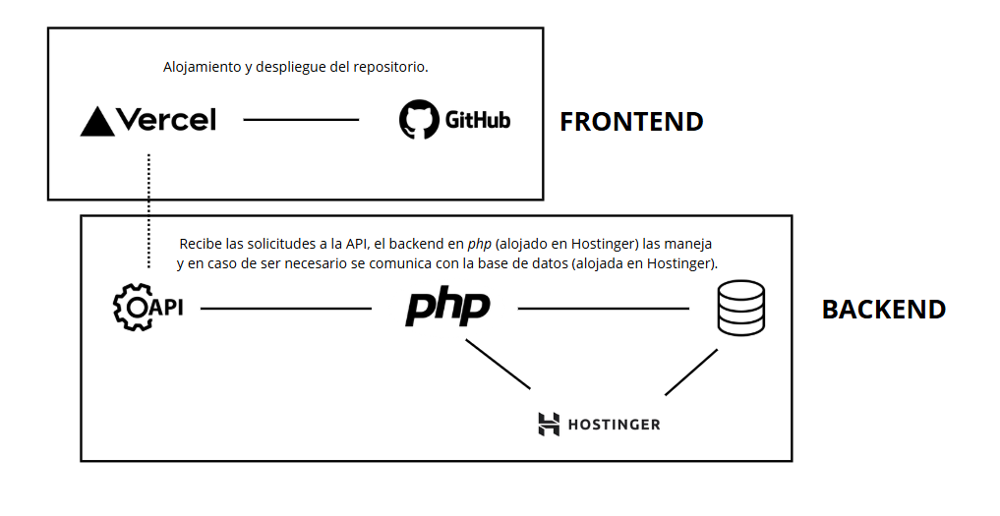
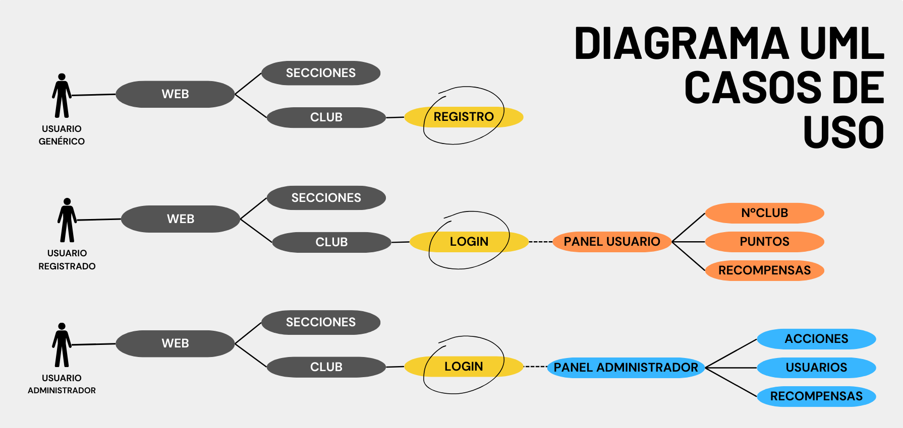
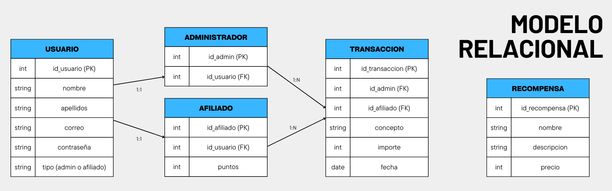

# FASE DE DESEÑO

- [FASE DE DESEÑO](#fase-de-deseño)
  - [1- Diagrama da arquitectura](#1--diagrama-da-arquitectura)
  - [2- Casos de uso](#2--casos-de-uso)
  - [3- Diagrama de Base de Datos](#3--diagrama-de-base-de-datos)
  - [4- Deseño de interface de usuarios](#4--deseño-de-interface-de-usuarios)

## 1- Diagrama da arquitectura

En el diagrama de arquitectura se pueden observar las dos secciones principales, el frontend y el backend. La primera está compuesta por el repositorio de GitHub, que contiene el proyecto con su código, este se despliega en Vercel. Esto permitirá que, al realizar cualquier cambio en el código del repositorio, automáticamente se refleje la nueva versión en la página web. Una vez desplegada, el frontend recibe las solicitudes de los usuarios y se comunica con el backend (alojado en Hostinger) mediante llamadas a la API. El backend está compuesto por la API y la BD, en lenguaje PHP. Aquí se procesan las solicitudes recibidas del frontend.

Un ejemplo sería el siguiente:
- El usuario realiza una acción en el frontend, y este envía una solicitud a la API.
- El backend valida la solicitud, y si es necesarios añade, modifica o elimina algo de la BD.
- Finalmente, se envía una respuesta al frontend con el resultado de la acción.

## 2- Casos de uso

Con este diagrama de casos de uso, se observa que a la página
principal podrían acceder todos los usuarios y navegar por las
distintas secciones. En cambio, para el club hay que estar registrado.

Los usuarios genéricos tienen la posibilidad de crear una cuenta para
poder entrar. El usuario registrado accede a su panel, donde puede
consultar su número en el club, su saldo de puntos y las recompensas
disponibles. Los administradores acceden con su cuenta a un panel
diferente. En este, se pueden realizar diferentes acciones (añadir
puntos, canjear recompensas, etc.).

## 3- Diagrama de Base de Datos

> *EXPLICACIÓN:* Neste apartado incluiranse os diagramas relacionados coa Base de Datos:
>
> - Modelo Entidade/relación

En el modelo relacional se observa como está organizada la información de los usuarios normales, administradores y afiliados. Por un lado, tiene tablas para cada tipo de usuario, otra para registrar las transacciones de puntos y la última para las recompensas disponibles.

## 4- Deseño de interface de usuarios

Como muestra, se pueden observar dos tipos de mockup, el de móvil y el de ordenador. En ellos, se puede simular lo que un usuario puede llegar a hacer (administrador, registrado o genérico) interactuando con diferentes secciones. Al hacer clic en cada imagen, se accederá al mockup correspondiente.

[**<-Anterior**](../../README.md)
