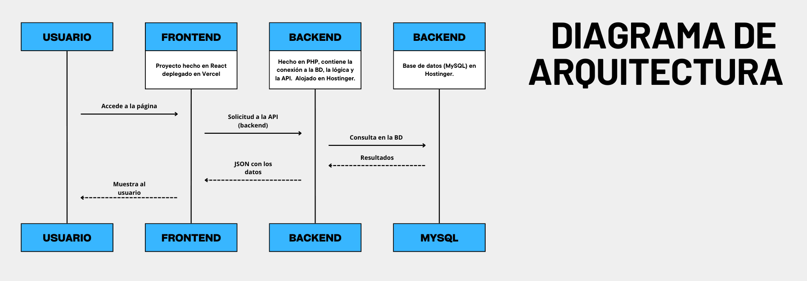
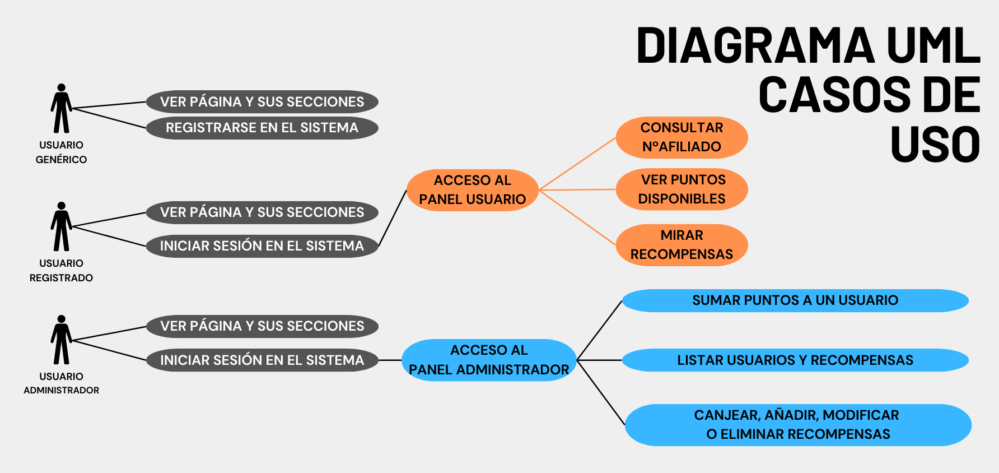
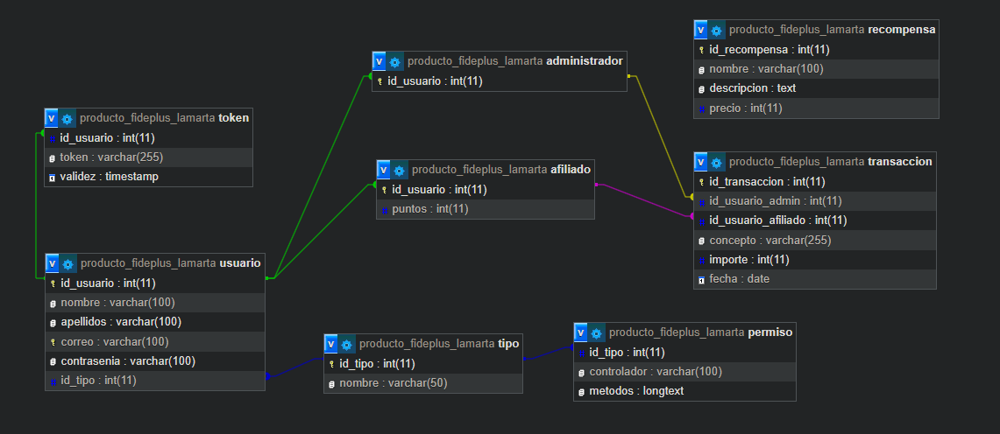
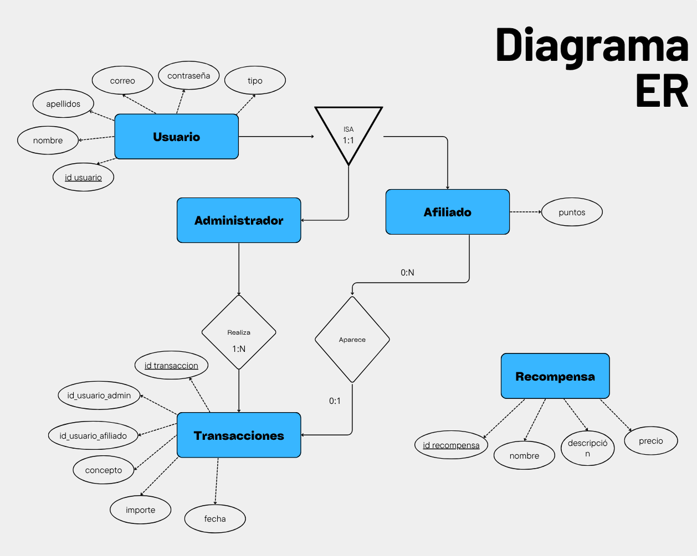
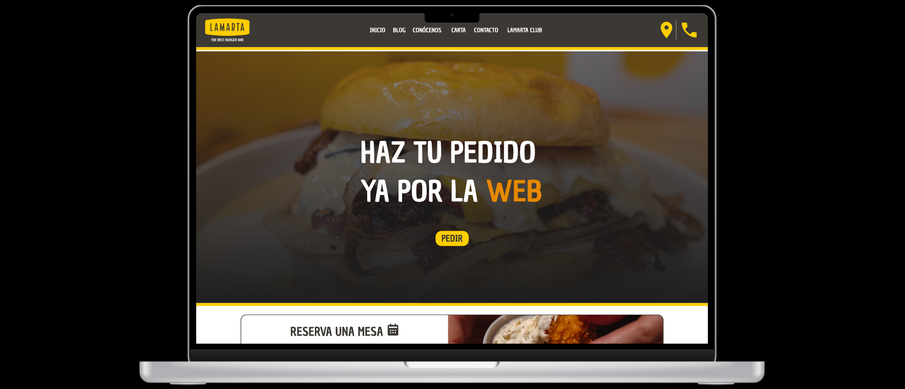

# FASE DE DESEÑO

- [FASE DE DESEÑO](#fase-de-deseño)
  - [1- Diagrama da arquitectura](#1--diagrama-da-arquitectura)
  - [2- Casos de uso](#2--casos-de-uso)
  - [3- Diagrama de Base de Datos](#3--diagrama-de-base-de-datos)
  - [4- Deseño de interface de usuarios](#4--deseño-de-interface-de-usuarios)

## 1- Diagrama da arquitectura

En el diagrama de arquitectura se pueden observar las dos secciones principales, el frontend y el backend. La primera está compuesta por el repositorio de GitHub, que contiene el proyecto con su código, este se despliega en Vercel. Esto permitirá que, al realizar cualquier cambio en el código del repositorio, automáticamente se refleje la nueva versión en la página web. Una vez desplegada, el frontend recibe las solicitudes de los usuarios y se comunica con el backend (alojado en IONOS) mediante llamadas a la API. El backend está compuesto por la API y la BD, en lenguaje PHP. Aquí se procesan las solicitudes recibidas del frontend.

Un ejemplo sería el siguiente:
- El usuario realiza una acción en el frontend, y este envía una solicitud a la API.
- El backend valida la solicitud, y si es necesarios añade, modifica o elimina algo de la BD.
- Finalmente, se envía una respuesta al frontend con el resultado de la acción.

## 2- Casos de uso

## 3- Diagrama de Base de Datos

## 4- Deseño de interface de usuarios

Como muestra, se pueden observar dos tipos de mockup, el de móvil y el de ordenador. En ellos, se puede simular lo que un usuario puede llegar a hacer (administrador, registrado o genérico) interactuando con diferentes secciones. Al hacer clic en cada imagen, se accederá al mockup correspondiente.

Los diseños tienen partes inspiradas en dos páginas principalmente y en elementos ya creados por la agencia de imagen de LAMARTA, aunque cambiados y adaptados a lo que se busca en esta nueva web. Estas son [Rhode](https://www.rhodeskin.com/) y [818 Tequila](https://drink818.com/).

[**<-Anterior**](../../README.md)
