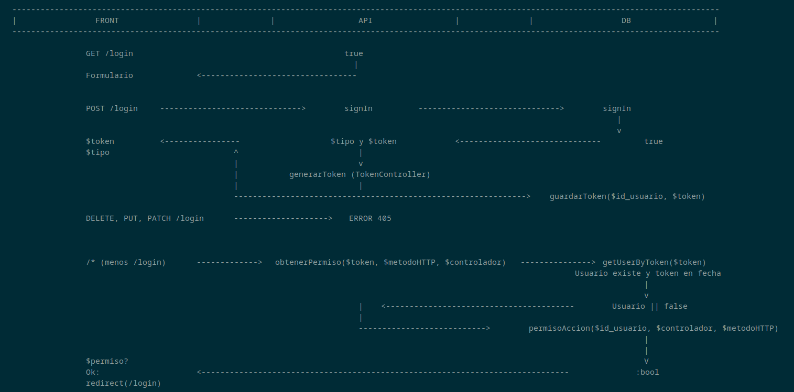

# FASE DE CODIFICACIÓN E PROBAS

- [FASE DE CODIFICACIÓN E PROBAS](#fase-de-codificación-e-probas)
  - [1- Codificación](#1--codificación)
  - [2- Prototipos](#2--prototipos)
  - [3- Innovación](#3--innovación)
  - [4- Probas](#4--probas)

## 1- Codificación

La carpeta que contiene el código del frontend es [lamarta.es](../../lamarta.es/) y la del backend [api.lamarta.es](../../api.lamarta.es/).

Al comienzo del desarrollo de la página, en la sección de incio, blog, conócenos, carta y contacto no hubo apenas cambios y es igual al prototipo. El menú desplegable y de la cabecera requirió informarse sobre [como utilizar las rutas en React](https://www.w3schools.com/react/react_router.asp). Para usarlo tuve que realizar _npm install react-dom-router._

Cuando ya estaban las pantallas, fue el momento de comenzar a privatizar las que se deben mostrar tras el login. Tras varios tipos y formas vistas, empleé un componente que vuelve una ruta privada para un rol, ya que me facilita después la comprobación de permisos y acceso. Cada vez que se cargue una página, comprobará que todo está correcto. En caso de que no, hará logout y redirigirá al login. No tuve muchas complicaciones gracias a las diferentes explicaciones y múltiples ejemplos de [esta página (4geeks)](https://4geeks.com/es/lesson/rutas-privadas-con-react-router).

En este punto, dejé a un lado el front y comencé a hacer la API para ya seguir con el login una vez acabada. A partir del modelo de una que hicimos en DWCS, comencé a desarrollar los diferentes controladores y modelos. Paralelamente, iba realizando solicitudes HTTP en Chrome de prueba con la extensión [Talend API Tester](https://chromewebstore.google.com/detail/talend-api-tester-free-ed/aejoelaoggembcahagimdiliamlcdmfm).

En el route.php se comprueba que el dominio del que proviene la solicitud HTTP es aceptado, que el método sea válido y qué cabeceras se permiten. Los navegadores envían primero una [solicitud del tipo OPTIONS](https://www.arsys.es/blog/cors-que-es-como-funciona-y-configuracion#tree-4) de prueba para verificar la seguridad de la petición y el acceso, ya que utilizan el mecanismo [CORS](https://developer.mozilla.org/es/docs/Web/HTTP/Guides/CORS). Este asegura que controles cuáles y desde dónde vienen las peticiones.

Para la contraseña utilicé [password_hash](https://www.php.net/manual/es/function.password-hash.php) y [password_verify](https://www.php.net/manual/es/function.password-verify.php). Al principio, iba a utilizar sha1 para encriptarla. Pero buscando, en todos los sitios hablaba de su poca seguridad, ya que permite millones de intentos por fuerza bruta en un segundo. [Con password_hash se utiliza](https://stackoverflow.com/questions/30279321/how-to-use-phps-password-hash-to-hash-and-verify-passwords) un algoritmo con el que nunca se puede repetir el hash a pesar de ser la misma contraseña. Cuando quieres comprobar si la contraseña coincide, se hace password_verify, que utiliza el hash de la base de datos para cifrar la introducida por el usuario y, si después coinciden, es que es correcta.

También tuve que emplear [PDO Transaction](https://www.phptutorial.net/php-pdo/php-pdo-transaction/), ya que realizo más de una query en algunos métodos y esto me ayuda a controlar los fallos no ejecutando las queries hasta que todas estén listas. Si están listas, se hace un commit para confirmar y, en caso de error en el catch, realizo un rollback que cancela estas sentencias.

La base de datos se creó casi como estaba prevista, solo que añadiendo las tablas de validación y modificando cosas pequeñas. Estas tablas de seguridad son la de token y permiso sumadas a usuario, tipo, administrador, afiliado, transaccion y recompensa. Una vez que la base de datos estaba completada y con la información básica, se realiza un dump de ella. De esta forma, te aseguras de que no hay ningún fallo a la hora de importarla en el futuro.

Una vez ya casi acabada la API, volví al front para empezar con las solicitudes. La primera fue en el login, utilizando la función ajax que se aprendió durante el curso en DWCC. Una vez que ya devolvía si el login era correcto o no, me puse a hacer el resto de la misma forma. La diferencia vino a la hora de recuperar algo más que un true o false. Antes hacía una función de render, pero ahora los pinto directamente [con un map](https://es.react.dev/learn/rendering-lists) del array recibido de la API.

En cuanto a la seguridad y validaciones, lo primero fue empezar a pensar en cómo lo iba a hacer. Primero hice un boceto simple y rápido sobre el flujo de funcionamiento del login y acceso a otras páginas. Cuando hace login, se devuelve un token que se utiliza de ahí en adelante para validar o hacer todo.

La idea de cómo funciona está inspirada un poco en el proyecto en el que trabajo en la empresa. Un usuario tiene un rol y este rol tiene diferentes permisos. Siempre se comprueba el tipo de usuario desde la base de datos y en una tabla se comprueba que tiene acceso a un controlador y al método. Finalmente, quedó con los métodos obtenerPermiso, comprobarValidez y generarToken.

Siempre que carga algo de una zona privada, comprueba que todas las credenciales son válidas, que el token es válido y que no está caducado. En caso de que algo esté cambiado o mal, lo echará de la sesión inmediatamente. Cada media hora hay que volver a iniciar sesión, ya que el token caduca.

Hasta aquí, para comunicar al usuario los errores o avisos, utilizaba los alert de Javascript. Me puse a buscar alguna librería que pudiese mejorar estas alertas además de hacerlas más bonitas. Encontré y utilicé [Notyf](https://github.com/caroso1222/notyf), que se encarga de mostrar estas notificaciones de forma muy simple. Para instalarlo, solo tuve que realizar el _npm install notyf_. Después, con las mismas explicaciones del repositorio fue suficiente.

A continuación me puse a pulir detalles y realizar las validaciones restantes, tanto en el front como en el back. También comencé a desplegar la API y la página. La fase de pruebas comenzará a partir de este punto. Diferentes personas participarán en la fase beta hasta que salga para todo el mundo. Para crear una cuenta, hace falta una contraseña que se le dará a los participantes.

## 2- Prototipos

Como muestra, se pueden observar dos tipos de mockup, el de móvil y el de ordenador. En ellos, se puede simular lo que un usuario puede llegar a hacer (administrador, registrado o genérico) interactuando con diferentes secciones. Al hacer clic en cada imagen, se accederá al mockup correspondiente.

Los diseños tienen partes inspiradas en dos páginas principalmente y en elementos ya creados por la agencia de imagen de LAMARTA, aunque cambiados y adaptados a lo que se busca en esta nueva web. Estas son [Rhode](https://www.rhodeskin.com/) y [818 Tequila](https://drink818.com/).

## 3- Innovación

A pesar de haber dado lo básico de React durante el curso, todavía no sabía realizar en este lenguaje muchas cosas que hacía en Javascript crudo. Esa quizás fue la mayor dificultad hasta coger soltura. Aprender a adaptar las cosas, como manejar las rutas, como utilizar los hooks y qué son e implementar una librería, entre otras cosas.

También a la hora de desplegar el proyecto, tuve que aprender lo básico de Vercel para poder conectarlo a mi repositorio de GitHub. El backend finalmente fue desplegado en IONOS, ya que Lamarta disponía de un servidor contratado previamente. La base de datos fue muy fácil de crear y conectar, ya que hacen tutorial paso a paso y es un phpMyAdmin.

## 4- Probas

Se realizaron pruebas reales con varias personas para buscar posibles errores y ver cómo va. Esto acompañado de un [plan de pruebas en Excel/Calc](./registro_casos_de_prueba.ods) en el que se intentará también cubrir todas las casuísticas. Otro punto fue comprobar que la página era responsive en todas sus pantallas de forma correcta.

En el backend, todo se resolvió a través del debugger y no hubo problemas mayores. Las pruebas fueron con [Talend API Tester](https://chromewebstore.google.com/detail/talend-api-tester-free-ed/aejoelaoggembcahagimdiliamlcdmfm) y con la aplicación.

[**<-Anterior**](../../README.md)
